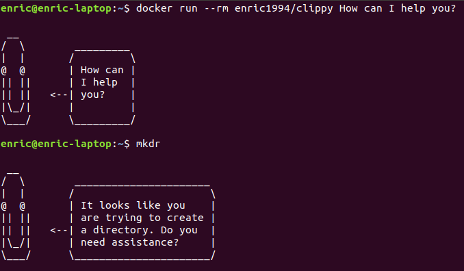

# Clippy: the best assistant ever



## Usage
`docker run --rm enric1994/clippy Do you need help?`

## Add the assistant to your alias
```
alias clippy='docker run --rm enric1994/clippy'
alias mkdr='clippy It looks like you are trying to create a directory. Do you need assistance?'
```

## Credits
https://github.com/gbigwood/Clippo